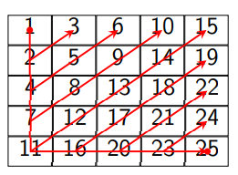

# Седмица 07 - Матрици

## Какво наричаме матрици?
Вече видяхме как могат да се дефинират масиви от прости типове. В същото време масиви могат да се дефинират и от сложни типове, включително от масиви. Нека видим един такъв пример:
```c++
int arr[3][3] = {
  {1, 2, 3}, 
  {4, 5, 6}, 
  {7, 8, 9}
};
```
В случая имаме масив, чиито елементи са масиви. Такива масиви ще наричаме матрици. Подобно на обикновените масиви и тук можем да пропуснем да напишем размера, но само на външния масив, понеже компилаторът не може да се "сети", какъв е размерът на вътрешните масиви по подразбиране. По подобен начин стоят нещата, когато подаваме матрици като параметри на функции - може да пропуснем размерът на външния масив, но задължително трябва да укажем какъв да е размера на вътрешните. Освен това трябва да подаваме и още 2 параметъра - от колко реда и от колко колони се състои нашата матрица, за да може да я обхождаме правилно. Пример с функция, която изкарва матрица на стандартния изход:
```c++
constexpr std::size_t MAX_SIZE{255};

void print(const int matrix[][MAX_SIZE], std::size_t rows, std::size_t columns) {
  for (std::size_t i = 0; i < rows; ++i) {
    for (std::size_t j = 0; j < columns; ++j) {
      std::cout << matrix[i][j] << ' ';
    }
    std::cout << '\n';
  }
}
``` 

## Задача 01 - Минимални елементи
```c++
std::size_t min_elements(const int matrix[][MAX_SIZE], std::size_t rows, std::size_t columns, int output[]);
```
Напишете функция, която приема матрица и `output` масив. Функцията да намира минималните елементи на всеки ред от матрицата и да ги записва в `output` масива. Функцията трябва да върне размерът на `output` след добавянето на всички минимални елементи в него.

### Пример:
```c++
int matrix[][MAX_SIZE]{
  {1, 2},
  {3, 2},
  {5, 3}
};
int output[MAX_SIZE]{};

std::size_t size = min_elements(matrix, 3, 2, output);

for(std::size_t i = 0; i < size; i++) {
  std::cout<< output[i] << ' ';
}
std::cout << '\n';
// -> 1 2 3
```

## Задача 02 - Главен диагонал
```c++
void print_main_diagonal(const int matrix[][MAX_SIZE], std::size_t n);
```
Напишете функция, която по подадена квадратна матрица, извежда на стандартния изход елементите по главния диагонал.

### Бонус:
Напишете функция, която прави същото, но за вторичния диагонал.

### Пример:
```c++
int matrix[][MAX_SIZE] = {
  {1, 2, 3},
  {4, 5, 6},
  {7, 8, 9}
};

print_main_diagonal(matrix, 3); // -> 1 5 9
std::cout << '\n';
```

## Задача 03 - Триъгълна матрица
```c++
bool is_triangular(const int matrix[][MAX_SIZE], std::size_t n);
```
Напишете функция, която проверява дали подадената квадратна матрица е триъгълна. Триъгълна матрица наричаме всяка матрица, която има само 0 в клетките под главния диагонал.

### Пример:
```c++
int matrix[][MAX_SIZE] = {
  {1, 2, 3},
  {0, 5, 6},
  {0, 0, 9}
};

std::cout << std::boolalpha << is_triangular(matrix, 3) << '\n'; // -> true
```

## Задача 04 - Транспониране
```c++
void transpose(const int matrix[][MAX_SIZE], std::size_t rows, std::size_t columns, int destination[][MAX_SIZE]);
```
Напишете функция, която по подадени матрици `matrix` и `destination`, записва транспонираната на `matrix` в `destination`.

### Пример:
```c++
int matrix[][MAX_SIZE]{
  {1, 2},
  {3, 4},
  {5, 6}
};

int output[MAX_SIZE][MAX_SIZE]{};
transpose(matrix, 3, 2, output);
print(output, 2, 3); /* -> 1 3 5
                           2 4 6 */
```

## Задача 05 - Умножение на матрици
```c++
void multiply(const int lhs[][MAX_SIZE], 
              std::size_t lhs_rows, 
              std::size_t lhs_columns, 
              const int rhs[][MAX_SIZE], 
              int destination[][MAX_SIZE]);
```
Напишете функция, която умножава две матрици и записва резултата в `destination` матрица. (Помислете защо в горната сигнатура подаваме размера само на първата матрица).

### Пример:
```c++
int first[][MAX_SIZE]{
  {1, 2, 3},
  {4, 5, 6},
};

int second[][MAX_SIZE]{
  {7, 8},
  {9, 10},
  {11, 12}
};

int output[MAX_SIZE][MAX_SIZE]{};

multiply(first, 2, 3, second, output);

print(output, 2, 2); /* -> 58 64
                           139 154 */
```

## Задача 06 - Обхождане
```c++
void traverse(const int matrix[][MAX_SIZE], std::size_t rows, std::size_t columns);
```
Напишете функция, която извежда елементите на матрица на стандартния изход в реда им на обхождане спрямо следния начин:



### Пример:
```c++
int matrix[][MAX_SIZE] = {
  {1, 2, 3},
  {4, 5, 6},
  {7, 8, 9}
};

traverse(matrix, 3, 3); // -> 1 4 2 7 5 3 8 6 9
std::cout << '\n';
```

## Задача 07* - Спирала
```c++
void traverse_spiral(const int matrix[][MAX_SIZE], std::size_t rows, std::size_t columns);
```
Напишете функция, която извежда елементите на матрица на стандартния изход в реда им на обхождане спрямо следния начин:


### Пример:
```c++
int matrix[][MAX_SIZE] = {
  {1, 2, 3},
  {4, 5, 6},
  {7, 8, 9}
};

traverse_spiral(matrix, 3, 3); // -> 1 2 3 6 9 8 7 4 5
std::cout << '\n';
```

## Задача 08** - Магически квадрат
```c++
void create_magic_square(std::size_t n, int destination[][MAX_SIZE]);
```
Напишете функция, която по подаден размер създава магически квадрат с този размер и го записва в `destination`. Магически квадрат наричаме всяка матрица, за която сумата на елементите на всеки ред, всяка колона и всеки диагонал е една и съща.

### Пример:
```c++
int matrix[MAX_SIZE][MAX_SIZE];
create_magic_square(4, matrix);
print(matrix, 4, 4);
/* -> 16 2 3 13 
      5 11 10 8 
      9  7 6 12 
      4 14 15 1 */
```