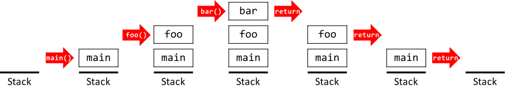

# Седмица 08 - Рекурсия

## Програмен стек
Стек е структура от данни, в която можем да слагаме елементи, но можем да премахваме само последния вкаран елемент (Last In First Out - LIFO). По-просто можем да си представяме елементите като тухлички, които редим една върху друга и можем да махнем само тази най-отгоре.



Програмния стек е стек, в който се записва информацията за функция, когато я извикаме. Тази информация е съответно коя е функцията, с какви аргументи трябва да се извика, от къде е била извикана и др. Най-отгоре на програмния стек стои функцията, която се изпълнява в текущия момент. Функцията директно под нея и тази, която я е извикала и в момента я чака да завърши. Съответно третата е тази, която е извикала втората и т.н. Погледнато по друг начин, програмния стек е "историята" на извикванията на функциите.

## Рекурсия
Рекурсия е повторение чрез позоваване на себе си. Следвайки тази дефиниция, рекурсивна функция е функция, която извиква себе си. Но тази дефиниция е малко забллуждаваща - една функция може да е рекурсивна, но да не извиква директно себе си - може да извиква друга функция, която да извиква повторно първата. Затова друг начин за представяне на рекурсивна функция е следния: функция, която се среща повече от веднъж в програмния стек.

## Ползите и недостатъците на рекурсията
Рекурсията е техника, която често се ползва в програмирането, поради следните си предимства:
- описва добре математически структури и понятия: голяма част от математическите структури се дефинират рекурсивно и е естествено, когато ги реализираме, да приложим рекурсия;
- улеснява някои по-сложни логики: както ще видим по-долу, рекурсията може да се използва за решаване на същите задачи, които могат да се решат с цикли. Понякога рекурсивния подход за решение на дадена задача е много по-прост и по-изчистен от итеративния.

Разбира се рекурсията си има недостатъци:
- изразходва повече памет от итеративния подход - колкото повече пъти извикаме функция рекурсивно, толкова повече памет ни трябва, за да запазим извикванията в програмния стек;
- изисква повече внимание от програмиста - за разликата от циклите, при рекурсивните функции никъде не се задава изрично колко пъти да се извикат и при невнимание лесно можем да достигнем до безкрайни извиквания.

## Рекурсия вместо цикли
Както стана дума, всяка задача, която може да се реши с цикъл, може да се реши и с рекурсия. Имаме проста схема, която трябва да следваме при използването на рекурсия за решаване на подобни задачи:
- правим си дъно на рекурсията - дъното на рекурсия е случай, зависещ от аргументите на функцията, при който нямаме рекурсивно извикване. Т.е. когато стигнем до такъв случай ще спрем да извикваме рекурсивно функцията и ще започнем да вадим извикванията на функцията от програмния стек едно по едно. Всеки път когато вадим извикване от стека, стойността на функцията се оценява за това извикване и се преминава към долното извикване с тази стойност;
- извикваме рекурсивно функцията - това е случая, в който не сме стигнали дъното. Това е всъщност основния случай, в който прилагаме някаква логика.

Пример за намиране на факториел:
```c++
unsigned factorial(unsigned n) {
    if(n == 0) {
        return 1;
    }

    return n * factorial(n - 1);
}
```
В този случай дъното е, когато `n` е равно на 0 - тогава връщаме директно 1 и започваме да вадим извикванията от програмния стек. Рекурсивното извикване е `n * factorial(n - 1)`. Така при достигане на дъното ще имаме следния израз: `n * (n - 1) * (n - 2) * ... * 2 * 1 * 1`, което е точно `n!`.

## Задача 01 - Сума на числа в интервал
```c++
int sum_interval(int begin, int end);
```
Напишете рекурсивна функция, която намира сумата на всички числа в интервала [begin, end].

### Пример:
```c++
std::cout << sum_interval(1, 10) << '\n'; // -> 55
```

## Задача 02 - Брой цифри
```c++
unsigned count_digits(unsigned n);
```
Напишете рекурсивна функция, която намира броя на цифрите на естествено число.

### Пример:
```c++
std::cout << count_digits(42891) << '\n'; // -> 5
```

## Задача 03 - Най-голям общ делител
```c++
unsigned gcd_rec(unsigned a, unsigned b);
```
Напишете рекурсивна функция, която намира най-големия общ делител на 2 естествени числа.

### Пример:
```c++
std::cout << gcd_rec(72, 90) << '\n'; // -> 18
```

## Задача 04 - Бързо степенуване
```c++
double quick_pow(double x, int n);
```
Напишете рекурсивна функция, която намира x<sup>n</sup> чрез метода на бързото степенуване:
- ако `n` е четно, тогава x<sup>n</sup> = x<sup>n/2<sup>2</sup></sup>;
- иначе x<sup>n</sup> = x*x<sup>n/2<sup>2</sup></sup>

### Пример:
```c++
std::cout << quick_pow(3, 6) << '\n'; // -> 729
```

## Задача 05 - Принтиране наобратно
```c++
void print_reverse(const char str[], std::size_t begin = 0);
```
Напишете рекурсивна функция, която принтира символен низ наобратно от подаден позиция нататък.

### Пример:
```c++
print_reverse("Hello World"); // -> dlroW olleH
std::cout << '\n';
```

## Задача 06 - Първо четно число
```c++
int find_first_even(const int arr[], std::size_t begin, std::size_t end);
```
Напишете рекурсивна функция, която намира индекса на първото четно число в масив. Ако такова не съществува, функцията да връща -1.

### Пример:
```c++
const int arr1[] {5, 7, 13, 3, 6, 23, 17};
const int arr2[] {5, 7, 13, 3, 39, 23, 17};

std::cout << find_first_even(arr1, 0, 7) << '\n'; // -> 4
std::cout << find_first_even(arr2, 0, 7) << '\n'; // -> -1
```

## Задача 07 - Сортиран масив
```c++
bool is_sorted(const int arr[], std::size_t begin, std::size_t end);
```
Напишете рекурсивна функция, която проверява дали масив е сортиран.

### Пример:
```c++
const int arr1[] {4, 7, 11, 16, 24};
const int arr2[] {4, 7, 5, 11, 18};

std::cout << std::boolalpha << is_sorted(arr1, 0, 5) << '\n'; // -> true
std::cout << is_sorted(arr2, 0, 5) << '\n'; // -> false
```

## Задача 08 - Палиндром
```c++
bool is_palindrome(const int arr[], std::size_t begin, std::size_t end);
```
Напишете рекурсивна функция, която проверява дали масив е палиндром. Масив е палиндром, когато ако се разгледат елементите му в обратен ред, се получава същият масив.

### Пример:
```c++
const int arr1[] {4, 7, 11, 7, 4};
const int arr2[] {4, 7, 11, 12, 7, 4};
std::cout << std::boolalpha << is_palindrome(arr1, 0, 5) << '\n'; // -> true
std::cout << std::boolalpha << is_palindrome(arr2, 0, 6) << '\n'; // -> false
```

## Задача 09 - Lower Bound
```c++
int lower_bound(const int arr[], std::size_t begin, std::size_t end, int element);
```
Напишете рекурсивна функция, която намира индекса на първото число в сортиран масив, което е не по-малко от дадено число. Ако няма такова число, да се върне номерът на последния индекс + 1.

### Бонус:
Задачата да се реши с метода на двоичното търсене.

### Пример:
```c++
const int arr[]{6, 7, 9, 10, 12, 15};

std::cout << lower_bound(arr, 0, 6, 12) << '\n'; // -> 4
std::cout << lower_bound(arr, 0, 6, 13) << '\n'; // -> 5
std::cout << lower_bound(arr, 0, 6, 16) << '\n'; // -> 6
```

## Задача 10 - Еднакви поредни елементи
```c++
int max_repeated(const int arr[], std::size_t begin, std::size_t end);
```
Напишете рекурсивна функция, която намира дължината на най-дългия подмасив, състоящ се от еднакви елементи.

### Пример:
```c++
const int arr[] {1, 1, 2, 3, 3, 3, 4, 2, 2, 2, 2, 1, 1};
std::cout << max_repeated(arr, 0, 13) << '\n'; // -> 4
```

## Задача 11 - Четни числа
```c++
std::size_t extract_evens(const char source[], std::size_t begin, int destination[]);
```
Напишете функция, която обхожда символен низ, намира всички четни числа в него и ги записва в масив от цели числа. Функцията да връща броя записани елементи.

### Пример:
```c++
int arr[255]{};
std::size_t size = extract_evens("458sade21asd4asd42a7sd8", arr);
print(arr, size); // -> 458 4 42 8
```

## Задача 12* - Ханойските кули
```c++
void towers_of_hanoi(unsigned n, char rod1, char rod2, char rod3);
```
Напишете функция, която решава задачата за [Ханойските кули](https://en.wikipedia.org/wiki/Tower_of_Hanoi), като извежда на стандартния изход ходовете, които трябва да бъдат направени.

### Пример:
```c++
towers_of_hanoi(3, 'A', 'B', 'C');
/*
-> Move disk 1 from rod A to rod C
   Move disk 2 from rod A to rod B
   Move disk 1 from rod C to rod B
   Move disk 3 from rod A to rod C
   Move disk 1 from rod B to rod A
   Move disk 2 from rod B to rod C
   Move disk 1 from rod A to rod C
*/
```